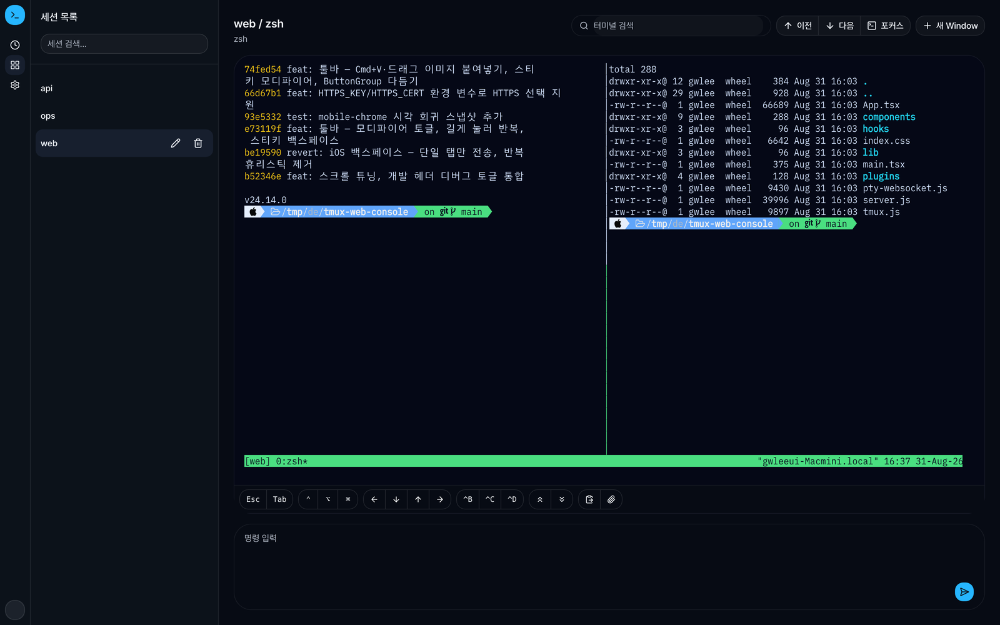
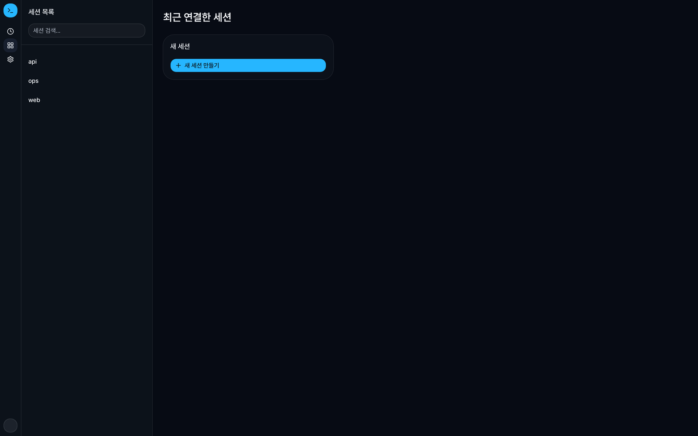

# tmux-web-console

브라우저에서 tmux 세션·창·패널을 다루는 원격 제어 콘솔입니다. Fastify 서버가
tmux를 브리지하고, React UI가 PTY-WebSocket으로 실시간 터미널을 렌더합니다.
AI 주도(바이브 코딩) 실험 프로젝트로, AI 도구의 생산성 상한을 확인하기 위해
사실상 전량을 AI와 함께 작성했습니다.



<details>
<summary>세션 홈 화면 보기</summary>



</details>

## 기능

**세션 · 창 · 패널**

- 좌측 트리로 세션/창/패널 탐색, 최근 선택 pane 탭바
- 세션 목록 조회 · 생성 · 종료, 창 생성

**터미널**

- xterm.js 실시간 터미널(PTY + WebSocket), 키 입력 직접 전달
- 터미널 영역 크기 변경 시 tmux pane 크기 동기화
- 버퍼 검색 / 다음 · 이전 이동, 선택 패널에 명령 전송

**그 외**

- capture-pane + SSE 보조 출력 스트림
- 세션 쿠키 기반 원격 보호, 주요 UI 문구 한글 제공

## 기술 구성

| 영역 | 선택 |
| --- | --- |
| 백엔드 | Fastify |
| 프론트엔드 | React + Vite |
| UI | shadcn/ui + Tailwind CSS v4 |
| 터미널 렌더링 | xterm.js + `@xterm/addon-fit` + `@xterm/addon-search` |
| 터미널 글꼴 | Monoplex KR Nerd (로컬 파일 제공) |
| 인증 | 아이디/비밀번호 로그인 + HttpOnly 세션 쿠키 |
| tmux 브리지 | `execFile('tmux', args)` |

## 동작 방식

- 기본 터미널 연결은 `node-pty`로 tmux client를 띄운 뒤 브라우저와 WebSocket으로 직접 연결합니다.
- 브라우저 입력은 WebSocket을 통해 PTY에 바로 기록되고, 터미널 박스 크기가 바뀌면 resize 이벤트가 함께 전달됩니다.
- 선택한 pane에 맞춰 붙기 위해 서버가 대상 pane/window를 먼저 정렬한 뒤 attach합니다.
- xterm 검색은 브라우저 버퍼를 대상으로 동작합니다.
- 기존 `capture-pane` + SSE 경로는 보조 API·fallback 용도로 유지됩니다.

## 시작하기

```bash
yarn install

# Prisma 클라이언트 생성 + 로컬 SQLite DB 준비 (최초 1회)
yarn prisma generate
mkdir -p data && yarn prisma migrate deploy

# 통합 개발 서버 (Fastify + Vite HMR)
yarn dev

# 서버 전용 개발 모드
yarn dev:server

# 프로덕션 (yarn start 전에 프론트엔드 빌드 자동 수행)
AUTH_PASSWORD='change-me' SESSION_SECRET='replace-with-a-long-random-secret' yarn start

# 검증
yarn test
yarn check
```

## 환경 변수

`.env.example` 값을 참고해 실행 환경에 주입하세요.

| 변수 | 기본값 | 설명 |
| --- | --- | --- |
| `HOST` | `0.0.0.0` | 바인드 주소 |
| `PORT` | `4317` | 포트 |
| `AUTH_USERNAME` | `admin` | 로그인 아이디 |
| `AUTH_PASSWORD` | `change-me` | 운영에서는 반드시 강한 값으로 교체 |
| `SESSION_SECRET` | `change-this-session-secret` | 충분히 긴 랜덤 문자열로 교체 |
| `SESSION_TTL_SECONDS` | `28800` | 세션 수명 |
| `COOKIE_SECURE` | `false` | HTTPS 뒤에서는 `true` 권장 |
| `PANE_HISTORY_LINES` | `200` | 패널 출력이 길면 줄여 응답량 조절 |
| `PANE_STREAM_INTERVAL_MS` | `1000` | SSE 폴링 간격 |
| `CORS_ORIGIN` | `*` | CORS 허용 오리진 |

## API

세션·인증(`/api/login` `/api/logout` `/api/auth/me`), 트리(`/api/tree`),
패널(`/api/panes/:paneId` + `input` `resize` `stream`),
세션·창·명령(`/api/sessions` `/api/windows` `/api/commands`),
PTY WebSocket(`/api/pty/socket`), 헬스체크(`/api/health`)를 제공합니다.

## 보안

세션 쿠키는 `HttpOnly` · `SameSite=Lax` · `Path=/` · `Max-Age=<SESSION_TTL_SECONDS>`를
사용하며, `Secure`는 `COOKIE_SECURE=true`일 때만 활성화됩니다. 개발 환경 기본값이
`false`인 이유는 HTTPS가 아닌 환경에서 `Secure` 쿠키가 동작하지 않기 때문입니다.

첫 단계라 다음은 아직 미구현입니다. 인터넷에 직접 노출하려면 추가를 권장합니다.

- 사용자별 권한 분리, 계정 저장소/암호 해시/비밀번호 재설정 흐름
- TLS 종료 / 프록시 하드닝, rate limiting, 감사 로그
